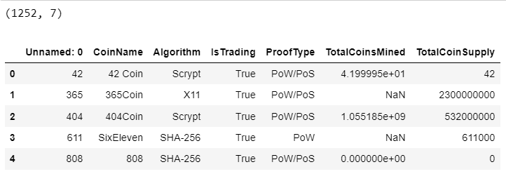
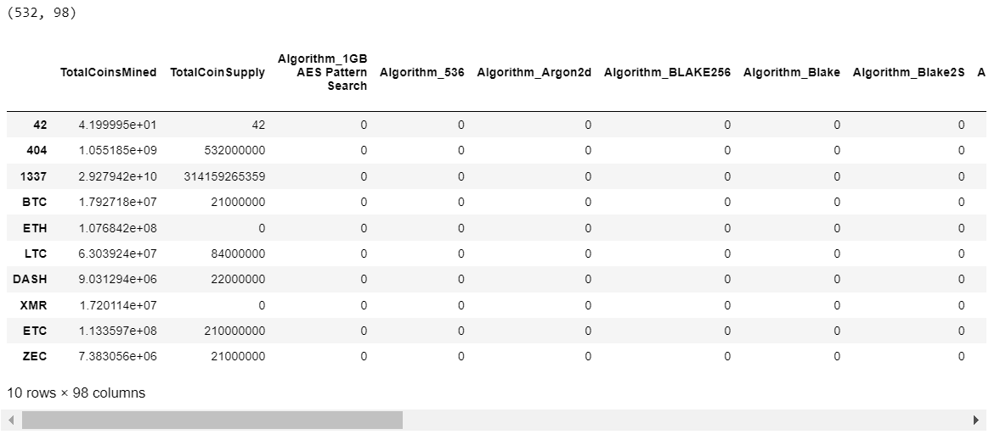
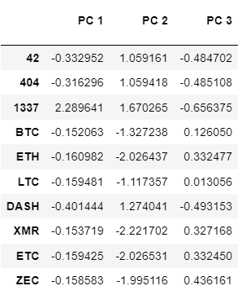
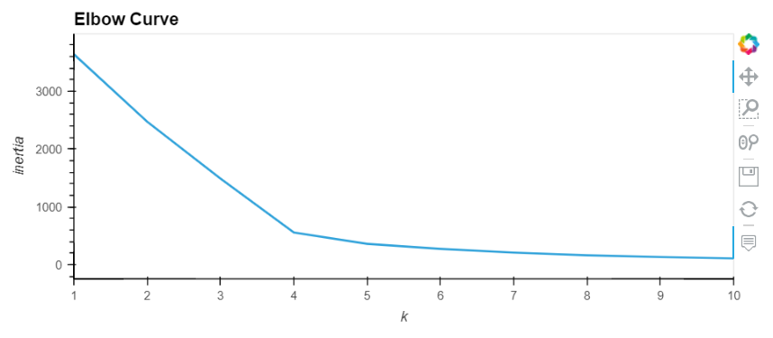
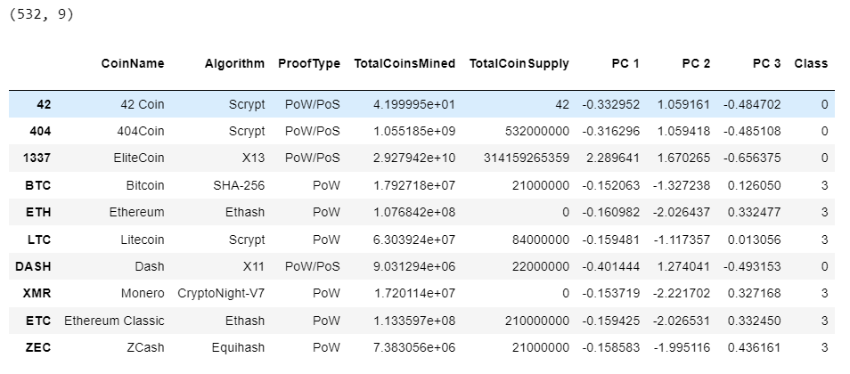
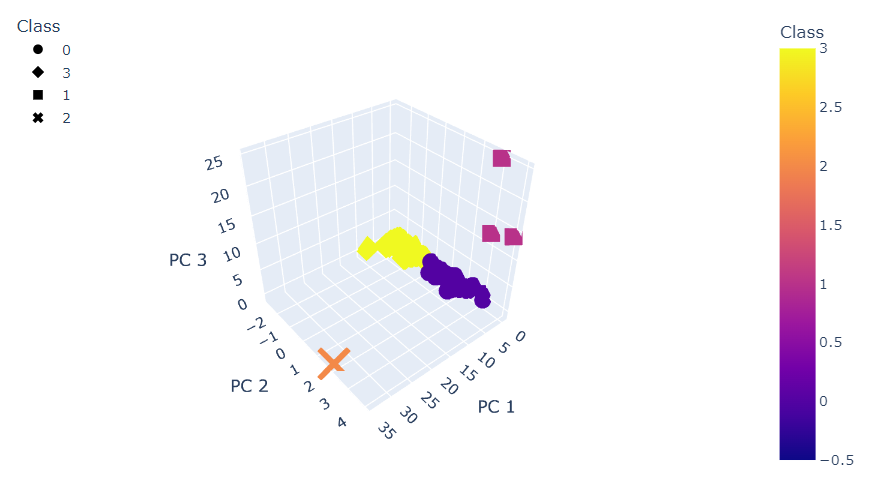
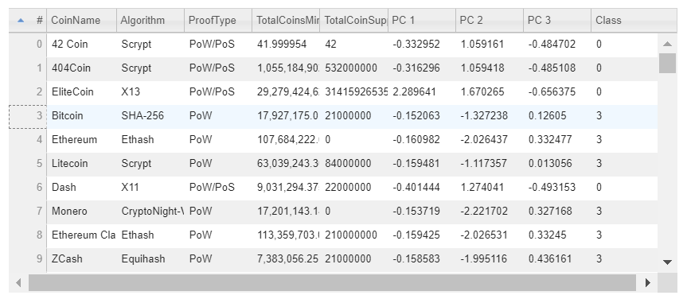
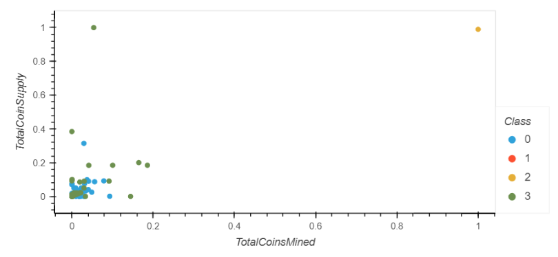

# Cryptocurrencies

## Overview
We were tasked with creating a report of cryptocurrencies and how they could be grouped to create a classification system. We will do this by clustering cryptocurrencies using unsupervised learning. In order to create this report we will complete the following steps.

- Preprocessing the Data for PCA
- Reducing Data Dimensions Using PCA
- Clustering Cryptocurrencies Using K-means
- Visualizing Cryptocurrencies Results

## Results

### Preprocessing the Data for PCA
While processing the crypto data we filtered the dataframe to only cryptocurrenices that are currently being trading and have been mined. We also dropped the IsTrading  and CoinName columns along with any rows with a null value. Then we set the Unnamed column to the DataFrame's index. Once we complete filtering and formatting the rows and columns, we use the get_dummies method for Algorithm and ProofType and then StandardScaler to standardize the features so the data is prepared for the model.

**Initial DataFrame**

**After Filtering and Formatting**

### Reducing Data Dimensions Using PCA
We complete this by reducing the dimensions to three principal components by applying PCA and crate a new DataFrame for PC 1, PC 2, and PC 3.

### Clustering Cryptocurrencies Using K-means
Found the best value for k by creating an elbow curve.

We can see from the elbow curve our best value for k is 4. We use 4 for the n_clusters in our KMeans model to make our class predictions. After getting our class predictions we create a new DataFrame to combined the CoinName, Predicted Class, and the rest of the coin features to use for visualization.

### Visualizing Cryptocurrencies Results
Created a 3-D Scatter with the PCA data and the cluster groups.

Created a table of the tradable cryptocurrencies that is sortable and selectable. Where we can see there are 532 tradable cryptocurrencies.

Lastly we scale the TotalCoinSupply and TotalCoinsMined data and combined it with the CoinName and Class in order to create a scatter plot grouped by Class for TotalCoinSupply and TotalCoinsMined.

